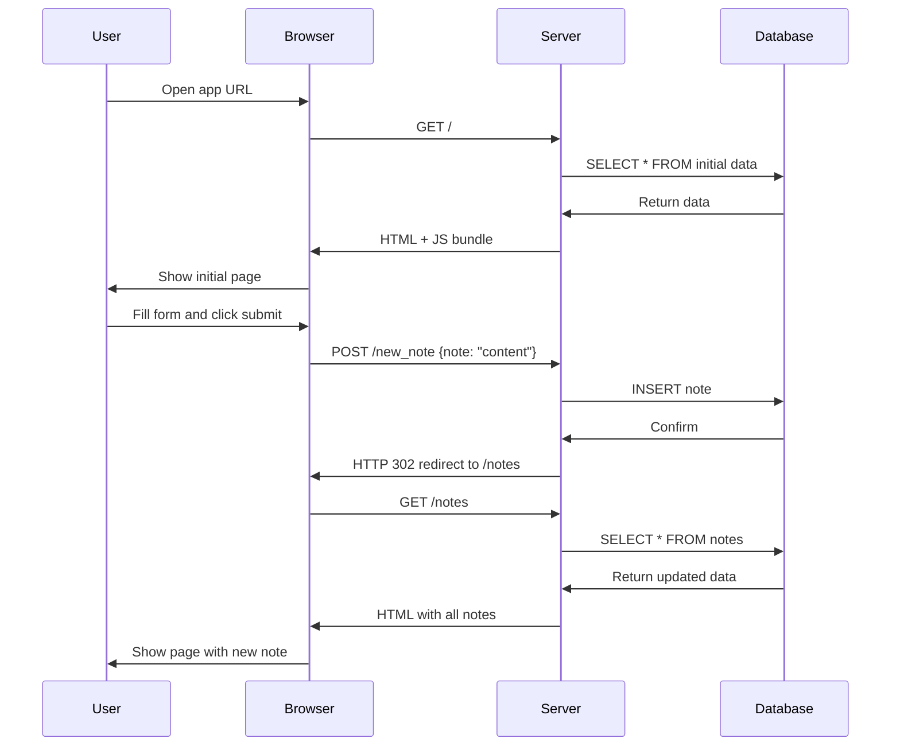

# Exercise 0.4 - Sequence diagram

```mermaid
sequenceDiagram
    participant User
    participant Browser
    participant Server
    participant Database
    
    User->>Browser: Open app URL
    Browser->>Server: GET /
    Server->>Database: SELECT * FROM initial data
    Database->>Server: Return data
    Server->>Browser: HTML + JS bundle
    Browser->>User: Show initial page
    
    User->>Browser: Fill form and click submit
    Browser->>Server: POST /new_note {note: "content"}
    Server->>Database: INSERT note
    Database->>Server: Confirm
    Server->>Browser: HTTP 302 redirect to /notes
    Browser->>Server: GET /notes
    Server->>Database: SELECT * FROM notes
    Database->>Server: Return updated data
    Server->>Browser: HTML with all notes
    Browser->>User: Show page with new note
```
